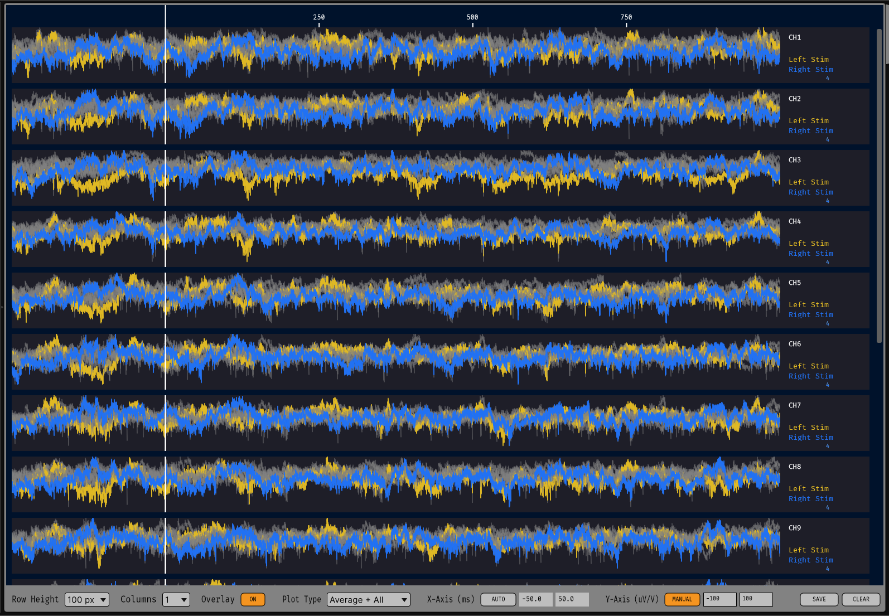
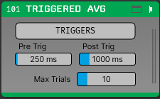

# Triggered Average

A plugin for the Open Ephys GUI that averages continuous signals triggered by TTL events and/or messages, similar to a triggered display on an oscilloscope. The plugin is still work-in-progress and may contain bugs or unexpected behavior. Please report any issues you encounter. 

## Installation

...

## Usage

### Basic Setup

Instructions for basic plugin usage will be documented here.

### Trigger Configuration

The plugin supports multiple trigger sources including TTL events and broadcast messages. Data is captured around these events. Triggers and capture parameters can be configured in the editor window.

### Display Options

The plugin provides real-time visualization of averaged signals with configurable pre- and post-trigger windows. 

## Building from source

Instructions for building the plugin from source can be found in the [Developer Guide](DEVELOPER_GUIDE.md).

## Attribution

This plugin was developed based on the [Online PSTH plugin](https://github.com/open-ephys-plugins/online-psth) by Joscha Schmiedt for the Brain Research Institute at University of Bremen, licensed under the GPLv3 (see [LICENSE.md](LICENSE.md))
